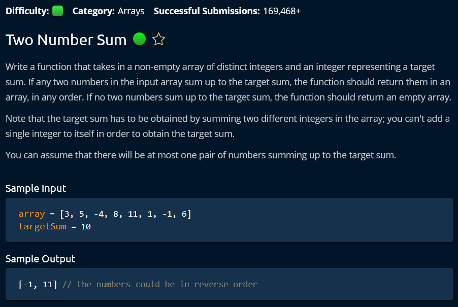

# 1. Two Number Sum

**Tags:** Brute Force, Two pointers - Traversal from both ends, Hashset, Sort

**Categories:** Arrays

## Problem description

<figure><figcaption><p>Problem description for "Two Number Sum"</p></figcaption></figure>

## Solutions

### Solution 1: Brute Force

**Time complexity:** O(N^2), where N is size of `array`

**Space complexity:** O(1)

**Tags:** Brute Force

**Categories:**



```cpp
#include <algorithm>
#include <vector>

using namespace std;

vector<int> twoNumberSum(vector<int> array, int targetSum) { 
    // O(N*log(N)) - Sort.
    sort(begin(array), end(array));
    auto sz = static_cast<int>(array.size());
    // O(N) - Two pointers
    for (int idx1 = 0, idx2 = sz - 1; idx1 < idx2;) {
        if (array[idx1] + array[idx2] == targetSum) {
            return {array[idx1], array[idx2]};
        } else {
            if (array[idx1] + array[idx2] < targetSum) {
                ++idx1;
            } else {
                --idx2;
            }
        }
    }
    return {};
}
```


### Solution 2: Two pointers

**Time complexity:** O(N\*log(N)), where N is size of `array`

**Space complexity:** O(1)

**Tags:** Sort, Two pointers - Traversal from both ends

**Categories:**


```cpp
#include <algorithm>
#include <vector>

using namespace std;

vector<int> twoNumberSum(vector<int> array, int targetSum) { 
    // O(N*log(N)) - Sort.
    sort(begin(array), end(array));
    auto sz = static_cast<int>(array.size());
    // O(N) - Two pointers
    for (int idx1 = 0, idx2 = sz - 1; idx1 < idx2;) {
        if (array[idx1] + array[idx2] == targetSum) {
            return {array[idx1], array[idx2]};
        } else {
            if (array[idx1] + array[idx2] < targetSum) {
                ++idx1;
            } else {
                --idx2;
            }
        }
    }
    return {};
}
```


### Solution 3: Hashset

**Time complexity:** O(N), where N is size of `array`. _Assumption:_ Insertion and retrieval in hashset is assumed to be O(1)

**Space complexity:** O(N), where N is size of `array`

**Tags:** Hashset

**Categories:**


```cpp
#include <unordered_set>
#include <vector>

using namespace std;

vector<int> twoNumberSum(vector<int> array, int targetSum) {
    // Write your code here.
    unordered_set<int> hash;
    for (auto num: array) {
        if (!hash.empty() && hash.find(targetSum - num) != end(hash)) {
            return { targetSum - num, num };
        }
        hash.emplace(num);
    }
    return {};
}C++
```


## References

*
